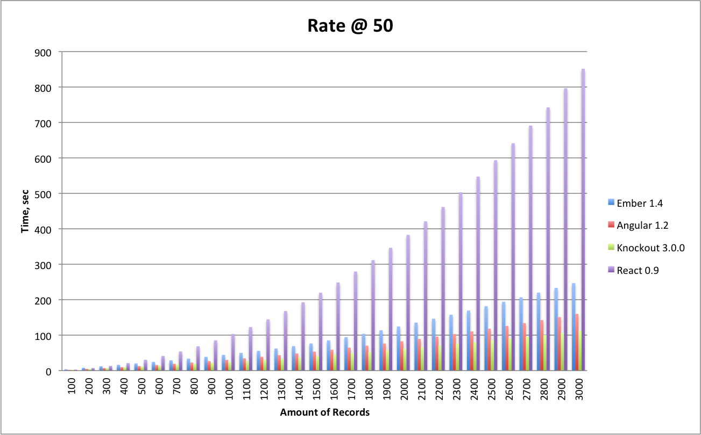

## Insanely Big Tables

### Why [TodoMVC](http://todomvc.com/) doesn't cut it
Performance of JavaScript, particularly of MVC frameworks becomes an issue due to fact that simple
website become an enterprise apps.

TodoMVC shows you the framework but tells nothing about its performance.
This project is intended to research the behavior of JavaScript frameworks on big data. It's not only the code
demonstration of the framework but also its performance (updates, scroll, bindings) utilizing relatively
big amount of data.

### Tests description
The JS MVC frameworks are challenged to check their behavior on big (seriously big) tables that can be
be updated continuously in relatively fast speed but not in batches.
For example, a new record might be added every half of a second out of several thousands.
So, the table should be updated fast, and possess smooth scrolling while adding at the same time.

Thus, the same test application is implemented for every framework candidate.
It has controls with buttons and inputs, and one table. The latter has two records with randomly generated number
from the very beginning.
Controls allow `Unshift`, `Push` a new records to the table. `Remove` and `Clear` can delete the selected record or clear
the whole table. Controls also have two input fields. In the first input field you can specify the rate at which new records
will be added to the table, e.g. `5` means that a new record will be added to the table every 200 milliseconds.
Please, keep in mind that the minimal timer for JS is 4 milliseconds. The second input field specifies the
overall amount of records that should be added to the table. Two fields on the right specify the current amount of
records in the table, and the elapsed time that took to populate the table.

### Statistics
The lower bar, the better.

### Candidates
* Angular v1.2
* Ember v1.4
* Knockout v3.0.0
* React 0.9

### Authors
* Ilan Goldfeld [New ProImage]
* Sergey N. Bolshchikov [New ProImage]
